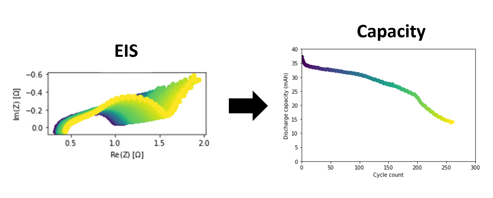

# MRS SP22 Tutorial

Materials for a tutorial on Battery Data Science and MRS SP22

## Using these tutorial materials

These tutorials are designed to be run on cloud resources. 
Simply click the following box to open the resources on Binder.

[](https://mybinder.org/v2/gh/battery-data-commons/mrs-sp22-tutorial/HEAD)

A few of the examples are best run on systems with a GPU. You'll see links to running those examples on Google Colab where appropriate.

### Local Installation

There are plenty of good reasons to run these examples on your own compute.
For example, using the cloud means that the results and any notes will disappear once you are done.

The first step is to install [Anaconda](https://docs.conda.io/en/latest/miniconda.html) on your computer and then build the environment by calling the following command from the command line.

```bash
conda env create --file environment.yml --force
```

Once done installing, Anaconda will give you a command to activate the computation environment. Active then call `jupyter lab` to open Jupyter.

## Machine learning with battery data
Tutorial instructor: Dr. Paul Gasper, Staff Scientist, National Renewable Energy Laboratory



This tutorial walks through the development of a machine-learning model predicting battery capacity from electrochemical impedance spectroscopy data, illustrating basic machine-learning topics such as evaluating model fitness with train/test splits, feature engineering methods, model interrogation, and visualizing predictions using the sklearn library for model development and matplotlib for visualization. The tutorial will use open-source data from Zhang et al, *Nature Communications* (2020) 11:1706 ([paper](https://www.nature.com/articles/s41467-020-15235-7.pdf), [github](https://github.com/YunweiZhang/ML-identify-battery-degradation)). This tutorial uses the following files:
- [eis/ml_predicting_capacity_with_eis.ipynb](/ml_predicting_capacity_with_eis.ipynb): Notebook for the tutorial
- [eis/ml_predicting_capacity_with_eis_solutions.ipynb](/ml_predicting_capacity_with_eis_solutions.ipynb): Notebook with solutions to challenge problems
- eis/eisplot.py: visualization function for plotting impedance data
- eis/plotyy.py: visualization function for creating parity plots
- eis/data/data_eis_zhang2020.csv: capacity and EIS measurements from 8 cells throughout their lifetime, from Zhang et al 2020 (see ref. above)
- eis/data/freq_eis_zhang2020.csv: frequency vector for plotting impedance data
